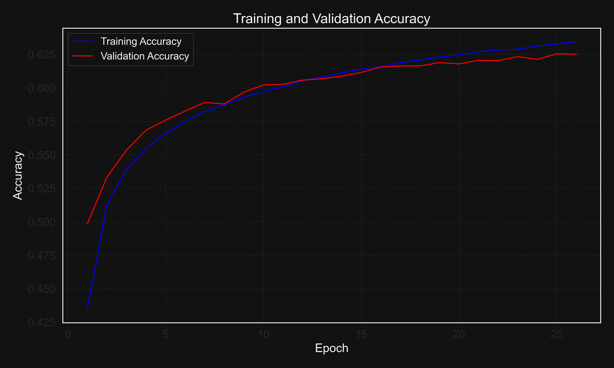
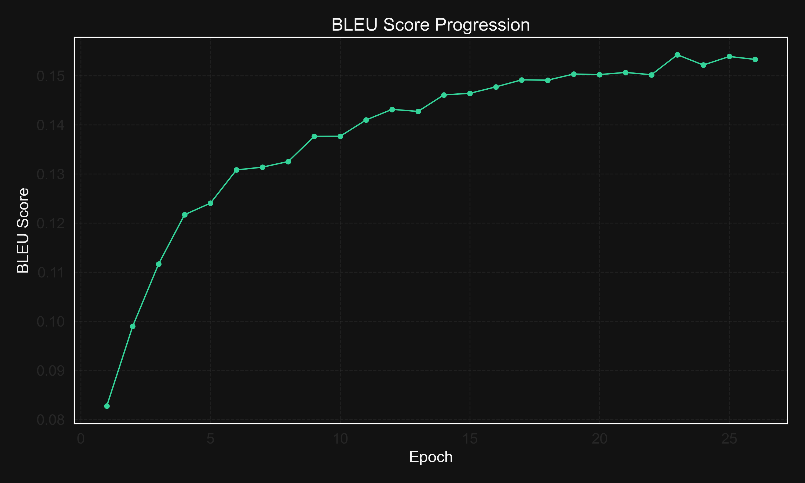
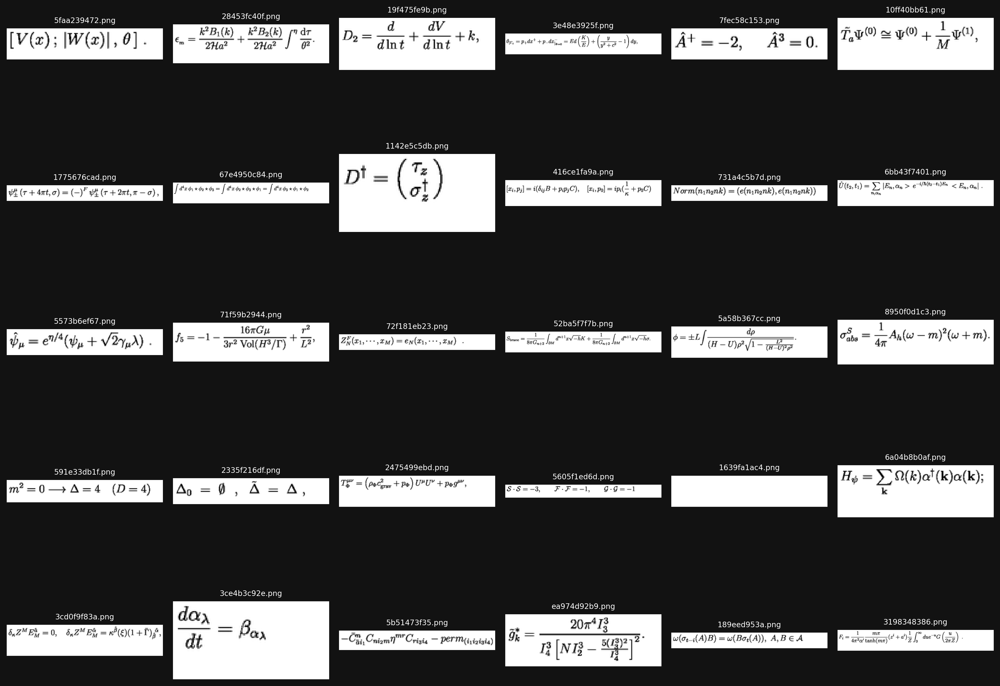

# Image to LaTeX Converter (img2latex)

[](https://github.com/Jeremy-Cleland/hmer-img2latex/actions/workflows/deploy.yml)

**View Project Website:** [https://jeremy-cleland.github.io/hmer-img2latex/](https://jeremy-cleland.github.io/hmer-img2latex/)

## Overview

The Image to LaTeX (img2latex) project implements a deep learning-based system for converting images of mathematical expressions into LaTeX code. This technology addresses a significant challenge in digital document processing: transforming visual representations of mathematical formulas into their corresponding markup representation, which is essential for editing, searching, and accessibility.

Mathematical expressions are ubiquitous in scientific, engineering, and academic literature, but transferring them between different formats can be cumbersome. Traditional Optical Character Recognition (OCR) systems often struggle with the complex two-dimensional structure of mathematical formulas. The img2latex project provides an end-to-end solution to automatically recognize and transcribe mathematical expressions from images, significantly reducing the manual effort required for digitizing printed mathematical content.

## Performance Metrics


| Metric | Value |
|--------|-------|
| Final Accuracy | 62.56% |
| BLEU Score | 0.1539 |
| Levenshtein Similarity | 0.2829 |
| Training Epochs | 25 |

## Features

- Two model architectures:
  - **CNN-LSTM**: A convolutional neural network encoder with an LSTM decoder
  - **ResNet-LSTM**: A pre-trained ResNet encoder with an LSTM decoder
- Multiple decoding strategies:
  - Greedy search
  - Beam search (with configurable beam size)
  - Sampling with temperature/top-k/top-p
- Comprehensive evaluation using multiple metrics:
  - Token-level accuracy
  - BLEU score
  - Levenshtein similarity
- Visualization and analysis tools
- Support for Apple Silicon (MPS acceleration), CUDA, and CPU
- Command-line interface for training, evaluation, and prediction

## Dataset Analysis

The project uses the IM2LaTeX-100k dataset, which contains over 100,000 images of mathematical expressions paired with their corresponding LaTeX code.


Key dataset statistics:
- **Total Images**: 103,536
- **Mean Width**: 319.2 px
- **Mean Height**: 61.2 px
- **Mean Aspect Ratio**: 5.79
- **Most Common Size**: 320×64 px
- **Color Mode**: RGB (100%)


Image properties:
- **Width range**: 128 - 800 pixels
- **Height range**: 32 - 800 pixels
- **Aspect ratio range**: 1.00 - 15.00
- **File format**: All images are RGB
- **Pixel value range**: 0.0 - 255.0 (uint8)
- **Mean pixel value**: 242.22
- **Std dev of pixel values**: 45.70

## Model Architecture

### 1. CNN-LSTM Architecture

The CNN-LSTM model consists of:
- **Encoder**: A convolutional neural network with three convolutional blocks, each containing:
  - Conv2D layer (with filters [32, 64, 128])
  - ReLU activation
  - MaxPooling layer
  - The final output is flattened and passed through a dense layer to create the embedding
- **Decoder**: An LSTM-based decoder that:
  - Takes the encoder output and previously generated tokens as input
  - Generates output tokens one at a time
  - Uses teacher forcing during training (ground truth tokens as input)
  - Offers optional attention mechanism to focus on different parts of the encoder representation

### 2. ResNet-LSTM Architecture

The ResNet-LSTM model replaces the CNN encoder with a pre-trained ResNet:
- **Encoder**: A pre-trained ResNet (options include ResNet18, ResNet34, ResNet50, ResNet101, ResNet152) with:
  - The classification head removed
  - Option to freeze weights for transfer learning
  - Final layer adapted to produce embeddings of the desired dimension
- **Decoder**: The same LSTM-based decoder as the CNN-LSTM model

## Training Process



The training process implements several key strategies:

### Optimization Setup
- **Optimizer**: Adam with configurable learning rate and weight decay
- **Learning Rate Scheduling**: ReduceLROnPlateau with patience 3, factor 0.5
- **Loss Function**: Cross-entropy with label smoothing (0.1)

### Training Techniques
- **Teacher Forcing**: Scheduled sampling approach transitioning from ground truth to predictions
- **Gradient Clipping**: Norm-based clipping (value: 5.0) to prevent exploding gradients
- **Early Stopping**: Training stops if validation metrics don't improve for 5 epochs
- **Checkpointing**: Regular saving of model checkpoints for resuming training

### Hardware Acceleration
- **Device Support**: CUDA for NVIDIA GPUs, MPS for Apple Silicon, CPU fallback
- **Mixed Precision**: FP16 computation where supported (30-40% faster training)

## Results



Our training process spanned 25 epochs, with the following progression in validation metrics for our best-performing model:

| Epoch | Loss   | Accuracy | BLEU   | Levenshtein |
|-------|--------|----------|--------|-------------|
| 1     | 2.2778 | 0.4986   | 0.0827 | 0.2311      |
| 5     | 1.8408 | 0.5760   | 0.1241 | 0.2609      |
| 10    | 1.6909 | 0.6022   | 0.1377 | 0.2716      |
| 15    | 1.6338 | 0.6116   | 0.1464 | 0.2781      |
| 20    | 1.6030 | 0.6180   | 0.1502 | 0.2799      |
| 25    | 1.5663 | 0.6256   | 0.1539 | 0.2829      |

The comparison between CNN-LSTM and ResNet-LSTM models showed:
- CNN-LSTM achieved 62.56% validation accuracy and a BLEU score of 0.1539
- ResNet50-LSTM achieved 59.42% accuracy and 0.1487 BLEU score in fewer epochs
- The CNN-LSTM architecture provided superior results with lower computational requirements

## Example Visualizations



## Installation

Clone the repository and install the package:

```bash
git clone https://github.com/Jeremy-Cleland/hmer-img2latex.git
cd hmer-im2latex
pip install -e .
```

## Data Preparation

The system uses the IM2LaTeX-100k dataset with the following structure:

```
data/
├── img/                  # Directory with formula images
│   ├── *.png             # Images of math formulas
├── im2latex_formulas.norm.lst   # Formulas in normalized format
├── im2latex_train_filter.lst    # Training split
├── im2latex_validate_filter.lst # Validation split
└── im2latex_test_filter.lst     # Test split
```

Each line in the split files has the format: `<image_file> <formula_index>`, where `<formula_index>` is the line number in the formulas file.

## Commands

### Training and Inference

```bash
# Train a new model
make train EXPERIMENT=experiment_name CONFIG=path/to/config.yaml

# Resume training from a checkpoint
make train-resume MODEL=path/to/checkpoint.pt EXPERIMENT=experiment_name

# Run prediction on an image
make predict MODEL=path/to/checkpoint.pt IMAGE=path/to/image.png

# Evaluate model on test set
make evaluate MODEL=path/to/checkpoint.pt
```

### CLI Commands

You can also use the CLI directly for more options:

```bash
# Training with custom parameters
python -m img2latex.cli train --config-path path/to/config.yaml --experiment-name experiment_name --device cuda

# Prediction with beam search
python -m img2latex.cli predict checkpoint.pt image.png --beam-size 5 --max-length 150

# Evaluation with custom batch size
python -m img2latex.cli evaluate checkpoint.pt data_dir --split test --batch-size 64 --beam-size 3
```

### Metrics and Analysis

```bash
# Visualize metrics for an experiment
make metrics-visualize EXPERIMENT=experiment_name

# Show latest metrics in a concise format
make metrics-latest EXPERIMENT=experiment_name

# Compare metrics across different experiments
make metrics-compare

# Export metrics to CSV or JSON
make metrics-export EXPERIMENT=experiment_name

# Run specific analysis tools
make analyze-images    # Analyze dataset images
make analyze-curves    # Plot learning curves
make analyze-tokens    # Analyze token distributions
make analyze-errors    # Analyze prediction errors
make analyze-preprocess # Visualize preprocessing steps

# Run all analysis tools
make analyze-all
```

### Development and Maintenance

```bash
# Initialize required directories
make dirs

# Lint code
make lint

# Format code
make format

# Run type checking
make typecheck

# Run all code quality checks
make check-all

# Clean Python artifacts
make clean-pyc

# Clean all outputs
make clean-outputs

# Clean only metrics files
make clean-metrics

# Clean everything
make clean-all

# Show help message with all commands
make help
```

For detailed information about the metrics system, see [README_METRICS.md](docs/README_METRICS.md).

## License

MIT License
